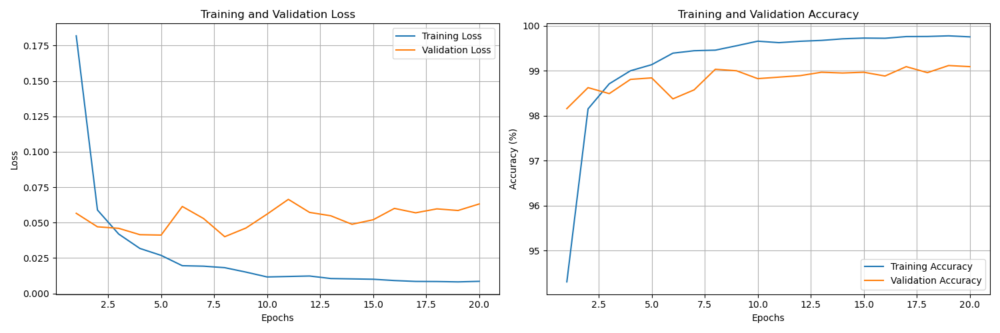
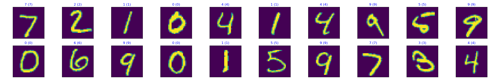

# MNIST Handwritten Digits Recognition

The [MNIST](http://yann.lecun.com/exdb/mnist/) database is a dataset of handwritten digits. It has 60,000 training samples, and 10,000 test samples. Each image is represented by 28x28 pixels, each containing a value 0 - 255 with its grayscale value.





## How to Install

Install required dependencies using:

```bash
pip install -r requirements.txt
```

## How to Run

### Training a Model

To train a model, run:

```bash
train_model.py [-h] --model {cnn,ffnn} [--epochs EPOCHS] [--debug_mode]
```

Example with Feed Forward Neural Network (FFNN) model:

```bash
python3 -m src.train_model --model ffnn --epochs 20
```


### Running Inference

To run inference on a trained model:

```bash
# Usage
python3 -m src.inference [-h] --model {cnn,ffnn} --image_path IMAGE_PATH [--requests]
```

Use the `--requests` flag when providing a URL as the image path:
    
```sh
python3 -m src.inference \
    --model ffnn \
    --image_path "https://upload.wikimedia.org/wikipedia/commons/thumb/8/88/Number_1_in_green_rounded_square.svg/512px-Number_1_in_green_rounded_square.svg.png?20080406024426" \
    --requests
```

## Repo's directory structure

The directory structure below shows the nature of files/directories used in this repo.

```sh
├── README.md
├── .gitignore
│
├── data              <- Dir structure.
│   └── MNIST         <- The original, immutable data dump
│
├── models            <- Trained models
│
└── src
    ├── config.py
    ├── dataset.py
    ├── inference.py
    ├── modeling
    └── train_model.py
```
